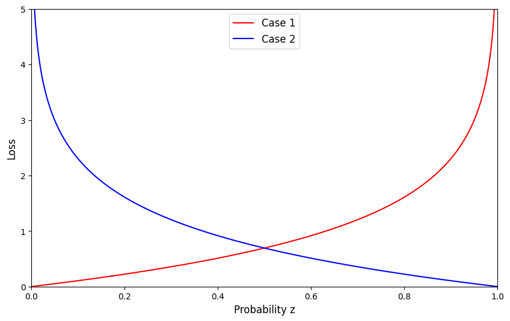

# Loss Function

## Problem 1

Case 1:

$$
\begin{aligned}
\lim_{ z \to -\infty } \frac{1}{1+\exp(-z)}.
\end{aligned}
$$

The term $1+\exp(-z)$ with $z \to -\infty$ will tend to $\infty$. Thus:

$$
\lim_{ z \to -\infty } \frac{1}{1+\exp(-z)} = \frac{1}{\infty} = 0.
$$

Case 2:

$$
\lim_{ z \to 0 }  \frac{1}{1+\exp(-z)} = \frac{1}{1+1} = \frac{1}{2}.
$$

Case 3:

$$
\lim_{ z \to \infty } \frac{1}{1+\exp(-z)}.
$$

The term $1+\exp(-z)$ with $z \to \infty$ will tend to $1$. Thus:

$$
\lim_{ z \to \infty } \frac{1}{1+\exp(-z)} = \frac{1}{1} = 1.
$$

## Problem 2

Let $z = sig[f[x,\phi]]$. The loss function become:

$$
L = -(1-y)\log(1-z)-y\log(z)
$$

Case 1: The training label $y=0$. We have:

$$
\begin{aligned}
L &= -(1-0)\log(1-z)-0\log(z) \\
&= -\log(1-z).
\end{aligned}
$$

Case 2: The training label $y=1$. We have:

$$
\begin{aligned}
L &= -(1-1)\log(1-z)-1\log(z) \\
&= -\log(z).
\end{aligned}
$$

Loss function:

As we can see in the above plotting, the loss of case 2 will high if probability z = 0, which means we make wrong decision, and it is lowing down when probability z tends to 1.0, which means we make correct choice. Case 1 has same intuition.

## Problem 5.3

Choosing the von Mises distribution:

$$
Pr(y \vert \mu, \kappa) = \frac{\exp[\kappa \cos[y-\mu]]}{2\pi \times Bessel_{0}[\kappa]}
$$

We want to predict the mean $\mu$. Thus, let $\mu = f[x, \phi]$ where $f[x, \phi]$ is our model. We have:

$$
\begin{aligned}
Pr(y \vert \mu, \kappa) &= \frac{\exp[\kappa \cos[y-\mu]]}{2\pi \times Bessel_{0}[\kappa]} \\
Pr(y \vert f(x, \phi), \kappa)&= \frac{\exp[\kappa \cos[y-f(x, \phi)]]}{2\pi \times Bessel_{0}[\kappa]}
\end{aligned}
$$

Using negative log-likelihood as a loss function. We have:

$$
\begin{aligned}
L[\phi] &= - \sum_{i=1}^I \log \left[Pr(y_{i} \vert f(x, \phi), \kappa)\right] \\
&= -\sum_{i=1}^I \log \left[\frac{\exp[\kappa \cos[y_{i}-f(x, \phi)]]}{2\pi \times Bessel_{0}[\kappa]} \right] \\
\end{aligned}
$$

We want to find parameter $\hat{\phi}$ that minimize this loss. Thus:

$$
\begin{aligned}
\hat{\phi} &= \underset{\phi}{\text{argmin}} \left[ -\sum_{i=1}^I \log \left[\frac{\exp[\kappa \cos[y_{i}-f(x, \phi)]]}{2\pi \times Bessel_{0}[\kappa]} \right]  \right] \\
&= \underset{\phi}{\text{argmin}} \left[ - \sum_{i=1}^I \log \left[ \exp[ \kappa \cos[y_{i} - f(x, \phi)] ] \right] - \log [2\pi \times Bessel_{0}[\kappa]] \right] \\
&= \underset{\phi}{\text{argmin}} \left[ - \sum_{i=1}^{I} \kappa \cos[y_{i} - f[x, \phi]] \right] \\
&= \underset{\phi}{\text{argmin}} \left[ - \sum_{i=1}^{I} \cos[y_{i} - f[x, \phi]] \right]
\end{aligned}
$$

Our final loss function $L[\phi]$ is:

$$
L[\phi] = - \sum_{i=1}^I \cos[y_{i} - f[x, \phi]]
$$

We want to get the direction $y$ that maximize the $Pr[y \vert f(x, \phi), \kappa]$. Or, we must take direction $y$ at the point that the distribution has largest value, which is our predicted parameter $\mu$. If this value out of range $[-\pi, \pi]$, we can add/subtract from multiples of $2\pi$ until it lies in the range.