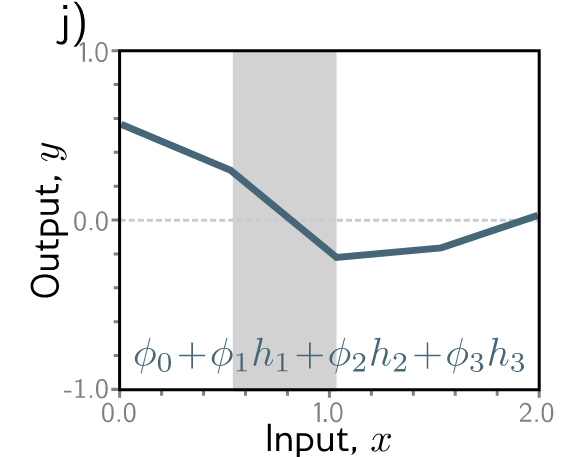

# Shallow Neural Networks

## Problem 3.1:
If the activation function is $a[z] = \psi_{0} + \psi_{1}z$, the mapping from input to output just the line with y-intercept is $\psi_{0}$ and slope is $\psi_{1}$. Next, if the activation function is $a[z] = z$, the mapping from input to output just the line with y-intercept equal $0$ and slope is $1$. Both activation functions just an affine mapping, which means no nonlinearity is introduced to the network.

## Problem 3.2:

Consider in that range, if the hidden unit value is $0$ (which means the pre-activation value is negative, leads to $ReLU$ clipped it to 0, which means in this range this hidden unit do not contribute anything to our network), then that hidden unit is inactive.

Region $1$: Hidden unit $3$ active, hidden unit $1,2$ inactive. 

Region $2$: Hidden unit $1, 3$ active, hidden unit $2$ inactive.

Region $3$: Hidden unit $1,2,3$ active.

Region $4$: Hidden unit $1, 2$ active, hidden unit $3$ inactive.

## Problem 3.3:
The joints are at the point that hidden unit cross the x-axis. Thus, we have:

Joint 1:

$$
\phi_{1} \times (\theta_{10} + \theta_{11}x) = 0 \implies x = \frac{-\theta_{10}}{\theta_{11}}
$$

Similarly for joint $2$, and joint $3$, which is at $\frac{-\theta_{20}}{\theta_{21}}$, and $\frac{-\theta_{30}}{\theta_{31}}$.

We have:

$$
y(x) = \phi_{0} + \sum_{i=1}^3 \phi_{i} \times \mathrm{ReLU}(\theta_{i0} + \theta_{i1}x) \implies \frac{dy}{dx} = \sum_{i=1}^3 \phi_{i} \times \theta_{i1}
$$

In arbitrary region, if exist hidden units that is inactivated, the slope of that region will not include this hidden unit due to the slope of that hidden unit is $0$. 

Slope of region $1$: $\phi_{3} \times \theta_{31}$.

Slope of region 2: $\phi_{1} \times \theta_{11} + \phi_{3} \times \theta_{31}$.

Slope of region $3$: $\phi_{1} \times \theta_{11} + \phi_{2} \times \theta_{21} + \phi_{3} \times \theta_{31}$.

Slope of region 4: $\phi_{1} \times \theta_{11} + \phi_{2} \times \theta_{21}$.

## Problem 3.5
***Proof.***

Case $1$: the input is negative ($z<0$), $\alpha \in R^+$

We have:

$$
\begin{cases}
\mathrm{ReLU}[\alpha \times z] = 0 \\
\alpha \times \mathrm{ReLU}[z] = \alpha \times 0 = 0
\end{cases} 
$$

Case $2$: the input is not negative ($z \geq 0$), $\alpha \in R^+$

We have:

$$
\begin{cases}
\mathrm{ReLU}[\alpha \times z] = \alpha \times z \\
\alpha \times \mathrm{ReLU}[z] = \alpha \times z
\end{cases}
$$

Thus, $\mathrm{ReLU}[\alpha \times z] = \alpha \times \mathrm{ReLU}[z]$ for $z \in R$ and $\alpha \in R^+$.